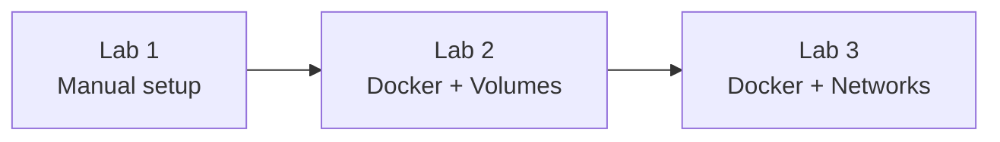
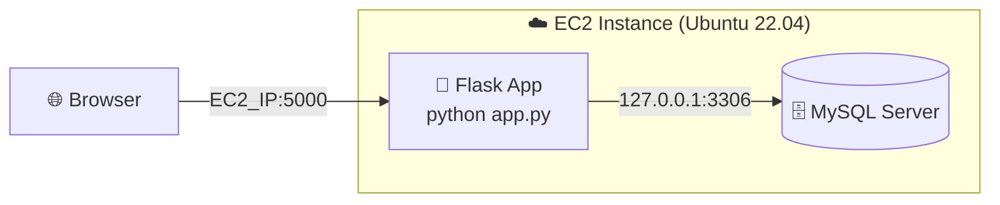
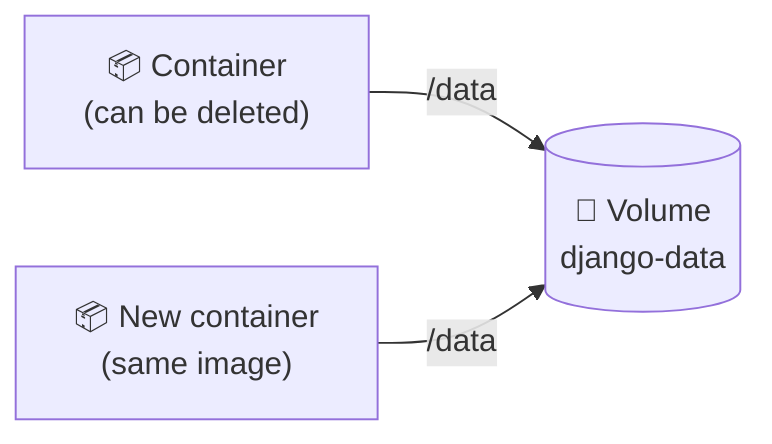
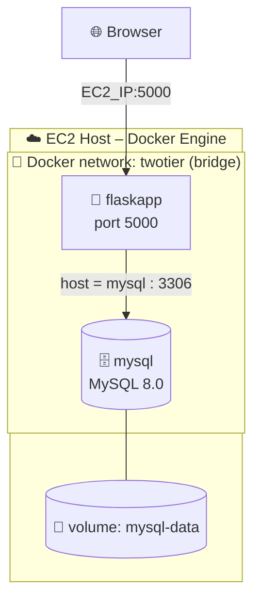

<div align="center">

# 🐳 DevOps Hands-On Labs: Flask, MySQL & Django on AWS EC2 with Docker

**Day 43 – Manual Two-Tier Deployment · Day 44 – Docker Volumes · Day 45 – Docker Networks**


*A complete, beginner-friendly, step-by-step guide. Every command has been reviewed and corrected so you can copy, paste and run.*

</div>

---

## 📑 Table of Contents

1. [About This Guide](#1--about-this-guide)
2. [Prerequisites](#2--prerequisites)
3. [Conventions Used](#3--conventions-used)
4. [Lab 1 – Manual Two-Tier Flask + MySQL on EC2](#4--lab-1--manual-two-tier-flask--mysql-on-ec2)
5. [Lab 2 – Django TODO App with Docker Volumes](#5--lab-2--django-todo-app-with-docker-volumes)
6. [Lab 3 – Containerized Two-Tier App with Docker Networks](#6--lab-3--containerized-two-tier-app-with-docker-networks)
7. [Appendix A – Push Images to GitHub Container Registry (GHCR)](#7--appendix-a--push-images-to-github-container-registry-ghcr)
8. [Appendix B – Troubleshooting](#8--appendix-b--troubleshooting)
9. [Appendix C – Docker Cheat Sheet](#9--appendix-c--docker-cheat-sheet)
10. [Appendix D – Cleanup (Avoid AWS Charges)](#10--appendix-d--cleanup-avoid-aws-charges)
11. [Appendix E – Security Best Practices](#11--appendix-e--security-best-practices)
12. [Appendix F – What Was Corrected in the Original Notes](#12--appendix-f--what-was-corrected-in-the-original-notes)

---

## 1. 📖 About This Guide

This guide takes you from a **manual** deployment to a **fully containerized** one, in three labs that build on each other.

| Lab | Topic | What you build | Port |
|-----|-------|----------------|------|
| **1** | Manual deployment | Flask app + MySQL installed directly on one EC2 server | `5000` |
| **2** | Docker Volumes | Django TODO app in a container, with data that survives restarts | `8000` |
| **3** | Docker Networks | Flask and MySQL in **two separate containers** talking over a private network | `5000` |

### What is a Two-Tier Architecture?

An application split into **two layers (tiers)**:

| Tier | Role | In our project |
|------|------|----------------|
| **Tier 1 – Application** | UI + business logic | Flask (Python) web app |
| **Tier 2 – Data** | Stores the data | MySQL database |


### Learning Path



### Source Repositories Used

| Project | Repository |
|---------|------------|
| Two-tier Flask + MySQL app (Labs 1 & 3) | <https://github.com/Umair1012/two-tier-flask-app> |
| Django TODO app (Lab 2) | <https://github.com/Umair1012/django-todo> |

[⬆ Back to top](#-table-of-contents)

---

## 2. ✅ Prerequisites

| Requirement | Details |
|-------------|---------|
| **AWS account** | Free-tier is enough (`t2.micro` / `t3.micro`) |
| **EC2 key pair** | A `.pem` file to SSH into the server |
| **GitHub account** | Needed for GHCR (Labs 2 & 3) |
| **Basic Linux skills** | `cd`, `ls`, `nano`, `sudo` |
| **A computer with SSH** | Terminal (Linux/macOS) or PowerShell / Git Bash (Windows) |

> [!NOTE]
> Use **Ubuntu Server 22.04 LTS** for every lab. All commands in this guide are written for it.

### Launch an EC2 Instance (used in all labs)

1. Open **AWS Console → EC2 → Launch instance**.
2. **AMI:** Ubuntu Server 22.04 LTS.
3. **Instance type:** `t2.micro` (free-tier eligible).
4. **Key pair:** create or select one, and download the `.pem` file.
5. **Security group (firewall) rules**, use the row for the lab you are doing:

| Lab | Port | Protocol | Source | Purpose |
|-----|------|----------|--------|---------|
| All | `22` | SSH | **My IP** | Connect to the server |
| 1 | `5000` | TCP | `0.0.0.0/0` | Flask web app |
| 2 | `8000` | TCP | `0.0.0.0/0` | Django web app |
| 3 | `5000` | TCP | `0.0.0.0/0` | Flask web app |

6. Click **Launch instance** and copy the **Public IPv4 address**.

### Connect to the Instance

```bash
chmod 400 your-key.pem
ssh -i your-key.pem ubuntu@<EC2_PUBLIC_IP>
```

> [!TIP]
> On Windows, if `chmod` is unavailable, use Git Bash or WSL. The key file must not be readable by other users, or SSH will refuse it.

[⬆ Back to top](#-table-of-contents)

---

## 3. 🔤 Conventions Used

| Symbol | Meaning |
|--------|---------|
| `<EC2_PUBLIC_IP>` | Replace with your instance's public IP |
| `YourStrongPassword` | Replace with a password of your choice |
| `$GH_USER` | Your **lowercase** GitHub username (set in [Appendix A](#7--appendix-a--push-images-to-github-container-registry-ghcr)) |
| 💻 | Run on the EC2 server (unless stated otherwise) |

> [!NOTE]
> Blocks starting with `[!NOTE]`, `[!TIP]`, `[!WARNING]` and `[!IMPORTANT]` are callouts. Read the warnings, they prevent the most common errors.

[⬆ Back to top](#-table-of-contents)

---

## 4. 🧪 Lab 1 – Manual Two-Tier Flask + MySQL on EC2

### 🏢 Scenario

A startup is building an MVP of a message-collection app. Before scaling, the DevOps team tests it on **one EC2 server** with Flask and MySQL installed by hand.

### 🎯 Objectives

- Clone the app from GitHub
- Install Python, Flask dependencies and MySQL
- Configure the database and start the app
- Open the app in a browser at `http://<EC2_PUBLIC_IP>:5000`

### 🗺️ Architecture



### Step 1 – Launch and connect to EC2

Follow [Launch an EC2 Instance](#launch-an-ec2-instance-used-in-all-labs) (open ports **22** and **5000**), then connect with SSH.

### Step 2 – Update the system and install packages

```bash
sudo apt update && sudo apt upgrade -y
sudo apt install -y git python3-pip python3-venv python3-dev \
    build-essential pkg-config default-libmysqlclient-dev mysql-server
```

**What each package does**

| Package | Why it is needed |
|---------|------------------|
| `git` | Download the project from GitHub |
| `python3-pip`, `python3-venv` | Install Python packages and create virtual environments |
| `python3-dev`, `build-essential`, `pkg-config`, `default-libmysqlclient-dev` | Required to compile the `mysqlclient` Python library used by Flask-MySQLdb |
| `mysql-server` | The database (Tier 2) |

### Step 3 – Clone the repository

```bash
git clone https://github.com/Umair1012/two-tier-flask-app.git
cd two-tier-flask-app
```

Project structure (main files):

```text
two-tier-flask-app/
├── app.py              # Flask application
├── message.sql         # SQL for the messages table (optional, the app creates it itself)
├── requirements.txt    # Python dependencies
├── Dockerfile          # Used later in Lab 3
├── .env                # Database settings (you will overwrite this)
└── templates/
    └── index.html      # Web page
```

### Step 4 – Create a virtual environment and install dependencies

```bash
python3 -m venv venv
source venv/bin/activate
pip install --upgrade pip
pip install -r requirements.txt
```

> [!TIP]
> Your prompt will start with `(venv)` when the environment is active. If you reconnect later, run `source venv/bin/activate` again.

### Step 5 – Start MySQL and set a root password

**5.1 Start MySQL and enable it on boot**

```bash
sudo systemctl start mysql
sudo systemctl enable mysql
sudo systemctl status mysql --no-pager
```

You should see `active (running)`.

**5.2 Open the MySQL shell (no password yet)**

```bash
sudo mysql
```

**5.3 Set the root password and create the database**

Run these inside the MySQL shell (replace the password):

```sql
ALTER USER 'root'@'localhost' IDENTIFIED WITH mysql_native_password BY 'YourStrongPassword';
CREATE DATABASE IF NOT EXISTS flaskapp;
FLUSH PRIVILEGES;
EXIT;
```

**5.4 Test the login**

```bash
mysql -u root -p
```

Enter your password. If you get a `mysql>` prompt, it works. Type `EXIT;`.

> [!NOTE]
> **You do not need to create a table by hand.** When `app.py` starts, it runs `CREATE TABLE IF NOT EXISTS messages (...)` automatically. The table is called `messages` and has two columns: `id` and `message`.

### Step 6 – Configure the environment variables

The app reads its database settings from a `.env` file using `python-dotenv`.

> [!WARNING]
> The repository already contains a `.env` file that points to **someone else's IP address**. You **must overwrite it**, otherwise the app will try to connect to the wrong server.

```bash
cat > .env <<'EOF'
MYSQL_HOST=127.0.0.1
MYSQL_USER=root
MYSQL_PASSWORD=YourStrongPassword
MYSQL_DB=flaskapp
EOF
```

Confirm the content:

```bash
cat .env
```

### Step 7 – Run the Flask app

```bash
python app.py
```

The code already listens on all network interfaces (`host='0.0.0.0'`, `port=5000`), so **no extra flags are needed**. You should see:

```text
✅ DB Config:
Host: 127.0.0.1
...
✅ Table created or already exists.
 * Running on http://0.0.0.0:5000/ (Press CTRL+C to quit)
```

**Keep it running after you close SSH (optional)**

```bash
# stop the app with CTRL+C first, then:
nohup python app.py > app.log 2>&1 &
tail -f app.log          # press CTRL+C to stop viewing logs
```

To stop the background app later: `pkill -f "python app.py"`

### Step 8 – Test in the browser

Open:

```text
http://<EC2_PUBLIC_IP>:5000
```

You should see the page **"Flask + MySQL App [2 tier]"** with a box labelled *"Type your message..."*. Type a message and submit it.

### Step 9 – Verify the data in MySQL

```bash
mysql -u root -p
```

```sql
USE flaskapp;
SELECT * FROM messages;
```

Expected output:

```text
+----+---------------------+
| id | message             |
+----+---------------------+
|  1 | Hello from Lab 1!   |
+----+---------------------+
```

🎉 **Lab 1 complete!** You have manually deployed a two-tier application.

### ✔️ Lab 1 Checklist

- [ ] EC2 instance running, ports 22 and 5000 open
- [ ] MySQL running and root password set
- [ ] `.env` overwritten with **your** values
- [ ] App reachable at `http://<EC2_PUBLIC_IP>:5000`
- [ ] Submitted message visible in the `messages` table

> **Troubleshooting:** see [Appendix B](#8--appendix-b--troubleshooting).

[⬆ Back to top](#-table-of-contents)

---

## 5. 💾 Lab 2 – Django TODO App with Docker Volumes

### 🏢 Scenario

A DevOps engineer must containerize a Django TODO app and run it on EC2. Users' TODOs must **not be lost** when the container is restarted, removed or upgraded. The solution is a **Docker volume**.

### 🎯 Objectives

- Clone the Django TODO repository
- Write a `Dockerfile` for the app
- Store the SQLite database in a **Docker volume**
- Push the image to GitHub Container Registry (GHCR)
- Run it on port `8000` and prove that data persists

### 🧠 Concept – What is a Docker Volume?

A container's filesystem is **temporary**: when the container is deleted, its data is deleted too. A **volume** stores data **outside** the container, so it survives restarts, removals and image upgrades.

| Type | Description | Typical use |
|------|-------------|-------------|
| **Named volume** | Created and managed by Docker (`-v django-data:/data`) | Databases, app data ✅ *(used in this lab)* |
| **Anonymous volume** | Unnamed, auto-created, hard to reuse | Short-lived scratch data |
| **Bind mount** | Maps a host folder into the container (`-v /host/path:/data`) | Development, sharing config files |



### 🗺️ How this lab works

| Piece | Value |
|-------|-------|
| Database file inside container | `/data/db.sqlite3` |
| Volume name | `django-data` |
| App URL | `http://<EC2_PUBLIC_IP>:8000/todos/` |

> [!IMPORTANT]
> **Why `/data` and not `/app`?** Mounting a volume over `/app` would hide your application code, and a named volume cannot be mounted onto a single **file** such as `/app/db.sqlite3`. The correct approach is to keep the database in its **own folder** (`/data`) and mount the volume there.

### Step 1 – Launch and connect to EC2

Follow [Launch an EC2 Instance](#launch-an-ec2-instance-used-in-all-labs) (open ports **22** and **8000**), then SSH in.

### Step 2 – Install Docker and Git

```bash
sudo apt update
sudo apt install -y docker.io git
sudo systemctl enable --now docker
sudo usermod -aG docker ubuntu
newgrp docker
```

Verify:

```bash
docker --version
docker run --rm hello-world
```

> [!NOTE]
> Python/pip do **not** need to be installed on the server for this lab, because Python runs **inside** the container.

### Step 3 – Clone the repository

```bash
git clone https://github.com/Umair1012/django-todo.git
cd django-todo
```

> [!WARNING]
> This repository has **no** `requirements.txt` and **no** `Dockerfile`, so we create both below. It also has `ALLOWED_HOSTS = []`, which makes Django reject requests sent to your EC2 IP (error *"Invalid HTTP_HOST header"*). The Dockerfile below fixes that too.

### Step 4 – Create the project files

**4.1 `requirements.txt`**

```bash
cat > requirements.txt <<'EOF2'
Django>=4.2,<5.0
EOF2
```

**4.2 `.dockerignore`** (keeps the image clean and stops the old sample database from being copied in)

```bash
cat > .dockerignore <<'EOF2'
.git
__pycache__/
*.pyc
db.sqlite3
.DS_Store
EOF2
```

**4.3 `Dockerfile`**

```bash
cat > Dockerfile <<'EOF2'
FROM python:3.10-slim

ENV PYTHONDONTWRITEBYTECODE=1 \
    PYTHONUNBUFFERED=1

WORKDIR /app

# Install dependencies first (better build caching)
COPY requirements.txt .
RUN pip install --no-cache-dir -r requirements.txt

# Copy the project
COPY . .

# 1) Make the database path configurable via SQLITE_PATH
# 2) Allow requests to the EC2 public IP (lab use only)
RUN sed -i "s|'NAME': os.path.join(BASE_DIR, 'db.sqlite3')|'NAME': os.environ.get('SQLITE_PATH', os.path.join(BASE_DIR, 'db.sqlite3'))|; s|^ALLOWED_HOSTS = \[\]|ALLOWED_HOSTS = ['*']|" todoApp/settings.py

# The database lives here; mount a volume on this folder
ENV SQLITE_PATH=/data/db.sqlite3
RUN mkdir -p /data

EXPOSE 8000

# Apply migrations, then start the server
CMD ["sh", "-c", "python manage.py migrate --noinput && python manage.py runserver 0.0.0.0:8000"]
EOF2
```

**Line-by-line explanation**

| Instruction | Meaning |
|-------------|---------|
| `FROM python:3.10-slim` | Small official Python base image |
| `WORKDIR /app` | All following commands run in `/app` |
| `COPY requirements.txt .` + `RUN pip install ...` | Installs Django |
| `COPY . .` | Copies the project code |
| `RUN sed ...` | Makes the DB path configurable and fixes `ALLOWED_HOSTS` |
| `ENV SQLITE_PATH=/data/db.sqlite3` | Tells Django where to store the database |
| `CMD [...]` | Creates tables (`migrate`), then starts the app on `0.0.0.0:8000` |

> [!WARNING]
> Type quotes in the Dockerfile as plain straight quotes `"`. Curly quotes `“ ”` (often introduced by copy-pasting from Word/PDF) cause the error *"failed to parse CMD"*.

### Step 5 – Create the Docker volume

```bash
docker volume create django-data
docker volume ls
```

### Step 6 – Build the image

Set your GitHub username (lowercase) and build. See [Appendix A](#7--appendix-a--push-images-to-github-container-registry-ghcr) if you have not set up GHCR yet.

```bash
export GH_USER=your-github-username      # lowercase only
docker build -t ghcr.io/$GH_USER/django-todo:latest .
```

Expected ending:

```text
Successfully tagged ghcr.io/your-github-username/django-todo:latest
```

### Step 7 – Push the image to GHCR

Complete **[Appendix A](#7--appendix-a--push-images-to-github-container-registry-ghcr)** (create token → login → push), then come back here.

```bash
docker push ghcr.io/$GH_USER/django-todo:latest
```

### Step 8 – Run the container with the volume

```bash
docker run -d \
  --name todo-app \
  -p 8000:8000 \
  -v django-data:/data \
  ghcr.io/$GH_USER/django-todo:latest
```

| Flag | Meaning |
|------|---------|
| `-d` | Run in the background |
| `--name todo-app` | Container name |
| `-p 8000:8000` | `host-port:container-port` |
| `-v django-data:/data` | Attach the volume `django-data` to the folder `/data` |

Check that it is running and healthy:

```bash
docker ps
docker logs todo-app
```

The logs should show migrations being applied and `Starting development server at http://0.0.0.0:8000/`.

### Step 9 – Open the app

```text
http://<EC2_PUBLIC_IP>:8000/todos/
```

Add a few TODO items (for example *"Learn Docker volumes"*).

### Step 10 – Prove that data persists 🔄

Destroy the container completely:

```bash
docker stop todo-app
docker rm todo-app
```

Start a **brand-new** container using the **same volume**:

```bash
docker run -d \
  --name todo-app \
  -p 8000:8000 \
  -v django-data:/data \
  ghcr.io/$GH_USER/django-todo:latest
```

Refresh the browser. ✅ **Your TODOs are still there.**

**Optional – see the difference without a volume**

```bash
docker rm -f todo-app
docker run -d --name todo-nodata -p 8000:8000 ghcr.io/$GH_USER/django-todo:latest
# add a TODO, then: docker rm -f todo-nodata and run again, the data is gone
docker rm -f todo-nodata
```

**Inspect the volume**

```bash
docker volume inspect django-data
```

### ✔️ Lab 2 Checklist

- [ ] Docker installed, user added to the `docker` group
- [ ] `requirements.txt`, `.dockerignore` and `Dockerfile` created
- [ ] Image built and pushed to GHCR
- [ ] Container runs with `-v django-data:/data`
- [ ] TODOs survive `docker stop` + `docker rm` + `docker run`

[⬆ Back to top](#-table-of-contents)

---

## 6. 🌐 Lab 3 – Containerized Two-Tier App with Docker Networks

### 🏢 Scenario

Now the Flask app and MySQL run in **two separate containers** that talk to each other over a private **Docker network**, just like a production setup.

### 🎯 Objectives

- Create a custom Docker **bridge network**
- Build the Flask image and push it to GHCR
- Run MySQL and Flask containers on that network
- Let Flask reach MySQL **by container name** (`mysql`)
- Access the app from a browser on port `5000`

### 🗺️ Architecture



### 🧠 Concept – Docker Networks

A Docker network lets containers communicate securely. On a **user-defined bridge network**, containers find each other **by name** through Docker's built-in DNS. So Flask can connect to `mysql` instead of a changing IP address.

| Driver | Description |
|--------|-------------|
| **bridge** | Default, isolated network on a single host. *(used here)* |
| **host** | Shares the host's network, no isolation |
| **none** | No networking at all |
| **overlay** | Connects containers across multiple hosts (Swarm) |

> [!IMPORTANT]
> Name-based DNS works **only on user-defined networks** (like `twotier`), **not** on the default `bridge` network.

### Step 1 – Launch and connect to EC2

Follow [Launch an EC2 Instance](#launch-an-ec2-instance-used-in-all-labs). Open ports **22** and **5000** only.

> [!WARNING]
> **Do not open port 3306 to `0.0.0.0/0`.** The database only needs to be reachable by the Flask container (inside Docker), not by the whole internet.

### Step 2 – Install Docker and Git

```bash
sudo apt update
sudo apt install -y docker.io git
sudo systemctl enable --now docker
sudo usermod -aG docker ubuntu
newgrp docker
```

> [!WARNING]
> **Do not install `mysql-server` on the host in this lab.** It would occupy port `3306` and the MySQL *container* would fail to start with *"port is already allocated"*. If you did Lab 1 on the same server, run `sudo systemctl stop mysql` first.

### Step 3 – Clone the repository

```bash
git clone https://github.com/Umair1012/two-tier-flask-app.git
cd two-tier-flask-app
```

### Step 4 – Review the Dockerfile

The repository **already includes a working Dockerfile**, no need to write one:

```dockerfile
FROM python:3.9-slim
WORKDIR /app

# System libraries needed to build mysqlclient (Flask-MySQLdb)
RUN apt-get update && apt-get install -y \
    gcc default-libmysqlclient-dev pkg-config python3-dev \
    && rm -rf /var/lib/apt/lists/*

COPY requirements.txt .
RUN pip install --no-cache-dir -r requirements.txt

COPY . .
CMD ["python", "app.py"]
```

> [!NOTE]
> The `RUN apt-get install ...` block is **essential**. Without it `pip install` fails while compiling `mysqlclient`.

**Keep the repo's `.env` out of the image** (it contains a hard-coded IP and password):

```bash
echo ".env" > .dockerignore
```

### Step 5 – Build the image

```bash
export GH_USER=your-github-username      # lowercase only
docker build -t ghcr.io/$GH_USER/two-tier-flask-app:latest .
```

### Step 6 – Push the image to GHCR

Complete **[Appendix A](#7--appendix-a--push-images-to-github-container-registry-ghcr)**, then:

```bash
docker push ghcr.io/$GH_USER/two-tier-flask-app:latest
```

### Step 7 – Create the Docker network

```bash
docker network create twotier
docker network ls
```

### Step 8 – Run the MySQL container

```bash
docker run -d \
  --name mysql \
  --network twotier \
  -v mysql-data:/var/lib/mysql \
  -e MYSQL_ROOT_PASSWORD=admin \
  -e MYSQL_DATABASE=mydb \
  -p 127.0.0.1:3306:3306 \
  mysql:8.0
```

| Flag | Meaning |
|------|---------|
| `--network twotier` | Attach to our private network |
| `-v mysql-data:/var/lib/mysql` | Keep the database files in a volume (from Lab 2) |
| `-e MYSQL_ROOT_PASSWORD=admin` | Root password *(use a stronger one outside labs)* |
| `-e MYSQL_DATABASE=mydb` | Create this database on first start |
| `-p 127.0.0.1:3306:3306` | Publish port 3306 **only to the EC2 host itself** (for testing). Flask does not need this, it uses the internal network. |

**Wait until MySQL is ready** (about 20–40 seconds on first start):

```bash
docker exec mysql mysqladmin ping -uroot -padmin --silent && echo "MySQL is ready ✅"
```

> [!TIP]
> If it prints nothing, wait a few seconds and run it again. You can also watch `docker logs -f mysql`.

### Step 9 – Run the Flask container

```bash
docker run -d \
  --name flaskapp \
  --network twotier \
  -e MYSQL_HOST=mysql \
  -e MYSQL_USER=root \
  -e MYSQL_PASSWORD=admin \
  -e MYSQL_DB=mydb \
  -p 5000:5000 \
  ghcr.io/$GH_USER/two-tier-flask-app:latest
```

> [!NOTE]
> `MYSQL_HOST=mysql` works because `mysql` is the **container name** and both containers are on `twotier`. Values passed with `-e` take priority over the `.env` file.

### Step 10 – Test the application

```text
http://<EC2_PUBLIC_IP>:5000
```

Submit a message, then check the logs:

```bash
docker ps
docker logs flaskapp
```

Expected `docker ps` (simplified):

```text
CONTAINER ID   IMAGE                                   PORTS                      NAMES
a1b2c3d4e5f6   ghcr.io/you/two-tier-flask-app:latest   0.0.0.0:5000->5000/tcp     flaskapp
d4e5f6a1b2c3   mysql:8.0                               127.0.0.1:3306->3306/tcp   mysql
```

Expected Flask log lines:

```text
✅ DB Config:
Host: mysql
...
✅ Table created or already exists.
```

### Step 11 – Verify the data in MySQL

```bash
docker exec -it mysql mysql -uroot -padmin mydb -e "SELECT * FROM messages;"
```

### Step 12 – Prove the containers talk over the network 🔍

**12.1 Inspect the network** (shows both containers and their IPs)

```bash
docker network inspect twotier
```

**12.2 Get a container's IP address**

```bash
docker inspect -f '{{range .NetworkSettings.Networks}}{{.IPAddress}}{{end}}' mysql
```

**12.3 Ping by name from inside the Flask container**

```bash
docker exec -it flaskapp bash
```

Inside the container:

```bash
apt update && apt install -y iputils-ping
ping -c 3 mysql          # by container name (Docker DNS)
hostname -I              # this container's own IP
exit
```

You should see replies such as `64 bytes from mysql.twotier (172.18.0.2)`. 🎉

### Step 13 – Prove the database also persists

```bash
docker rm -f mysql
docker run -d --name mysql --network twotier \
  -v mysql-data:/var/lib/mysql \
  -e MYSQL_ROOT_PASSWORD=admin -e MYSQL_DATABASE=mydb \
  -p 127.0.0.1:3306:3306 mysql:8.0
docker exec mysql mysqladmin ping -uroot -padmin --silent && echo ready
```

Refresh the browser. Your old messages are still there because they live in the `mysql-data` volume.

### ✔️ Lab 3 Checklist

- [ ] Docker network `twotier` exists
- [ ] Image pushed to GHCR
- [ ] Two containers (`mysql`, `flaskapp`) running on `twotier`
- [ ] App works on port `5000` and rows appear in `messages`
- [ ] `ping mysql` works from inside `flaskapp`
- [ ] Port 3306 is **not** open to the internet

[⬆ Back to top](#-table-of-contents)

---

## 7. 📤 Appendix A – Push Images to GitHub Container Registry (GHCR)

GHCR (`ghcr.io`) stores your Docker images inside your GitHub account.

### A.1 Create a Personal Access Token (classic)

1. Open <https://github.com/settings/tokens> → **Generate new token (classic)**.
2. Give it a name and an expiry date.
3. Tick the scopes:
   - `write:packages`
   - `read:packages`
   - `delete:packages` *(optional)*
4. Click **Generate token** and **copy it immediately** (GitHub shows it only once).

> [!IMPORTANT]
> GHCR needs a **classic** token. Fine-grained tokens do not support packages.

### A.2 Log in to GHCR

```bash
export GH_USER=your-github-username     # lowercase
export GHCR_PAT=paste_your_token_here
echo "$GHCR_PAT" | docker login ghcr.io -u "$GH_USER" --password-stdin
```

Expected: `Login Succeeded`.

### A.3 Name and tag your image

Format: `ghcr.io/<OWNER>/<IMAGE_NAME>:<TAG>`, **all lowercase**.

If you built with this format already (as in Labs 2 and 3), skip tagging. For an existing local image:

```bash
docker tag my-image ghcr.io/$GH_USER/my-image:latest
```

### A.4 Push

```bash
docker push ghcr.io/$GH_USER/my-image:latest
```

### A.5 (Optional) Make the image public

1. GitHub → your **profile picture → Your profile → Packages** tab.
2. Open the package → **Package settings**.
3. **Danger Zone → Change visibility → Public**.

### A.6 Pull the image on another machine

```bash
# only needed if the package is private
echo "$GHCR_PAT" | docker login ghcr.io -u "$GH_USER" --password-stdin

docker pull ghcr.io/$GH_USER/my-image:latest
```

### Alternative – Docker Hub

```bash
docker login
docker tag my-image yourdockerhubusername/my-image:latest
docker push yourdockerhubusername/my-image:latest
```

[⬆ Back to top](#-table-of-contents)

---

## 8. 🛠️ Appendix B – Troubleshooting

| Problem | Likely cause | Fix |
|---------|--------------|-----|
| Browser cannot open the site (timeout) | Security group port closed | EC2 → Security Groups → add inbound `5000` (or `8000`) from `0.0.0.0/0` |
| `Permission denied (publickey)` on SSH | Wrong key or user | Use `ssh -i key.pem ubuntu@IP` and `chmod 400 key.pem` |
| `permission denied ... docker.sock` | User not in docker group | `sudo usermod -aG docker ubuntu && newgrp docker` |
| `pip install` fails building `mysqlclient` | Missing system libraries | `sudo apt install -y python3-dev build-essential pkg-config default-libmysqlclient-dev` |
| Lab 1: page shows `❌ Error loading messages` / *Can't connect to MySQL* | Wrong `.env` (repo's default points to another IP) | Rewrite `.env` as in Lab 1 Step 6, restart the app |
| Lab 1: `Access denied for user 'root'` | Password mismatch | Make `.env` password match the one set with `ALTER USER` |
| Lab 2: `Invalid HTTP_HOST header` (HTTP 400) | `ALLOWED_HOSTS` empty | Use the Dockerfile from Lab 2 (its `sed` line fixes this) |
| Lab 2: `no such table: todos_todo` | Migrations not run | Make sure the `CMD` includes `python manage.py migrate` |
| Lab 2: `failed to parse CMD` | Curly quotes | Retype quotes as straight `"` |
| Lab 3: `port is already allocated` (3306) | Host MySQL is running | `sudo systemctl stop mysql && sudo systemctl disable mysql` |
| Lab 3: `Unknown host mysql` / can't connect | Containers not on same network | Run both with `--network twotier`; check `docker network inspect twotier` |
| Lab 3: page shows *table doesn't exist* | Flask started before MySQL was ready | `docker restart flaskapp` (it creates the table on startup) |
| Lab 3: `Conflict. The container name "/mysql" is already in use` | Old container exists | `docker rm -f mysql` and run again |
| `docker push` → `denied` / `unauthorized` | Not logged in, wrong scope, or uppercase name | Repeat [A.2](#a2-log-in-to-ghcr); use a token with `write:packages`; image name must be lowercase |
| MySQL container keeps exiting on `t2.micro` | Only 1 GB RAM | Add swap: `sudo fallocate -l 1G /swapfile && sudo chmod 600 /swapfile && sudo mkswap /swapfile && sudo swapon /swapfile` |

**Useful debugging commands**

```bash
docker ps -a                 # all containers, including stopped
docker logs -f <name>        # live logs
docker inspect <name>        # full details
docker exec -it <name> bash  # shell inside a container
```

[⬆ Back to top](#-table-of-contents)

---

## 9. 📋 Appendix C – Docker Cheat Sheet

| Task | Command |
|------|---------|
| Build image | `docker build -t name:tag .` |
| List images | `docker images` |
| Run container | `docker run -d --name n -p HOST:CONT image` |
| List running containers | `docker ps` |
| Stop / start / remove | `docker stop n` · `docker start n` · `docker rm n` |
| Force remove | `docker rm -f n` |
| Logs | `docker logs -f n` |
| Shell inside | `docker exec -it n bash` |
| Create / list / inspect volume | `docker volume create v` · `docker volume ls` · `docker volume inspect v` |
| Remove volume | `docker volume rm v` |
| Create / list / inspect network | `docker network create net` · `docker network ls` · `docker network inspect net` |
| Tag image | `docker tag src ghcr.io/user/img:tag` |
| Push / pull | `docker push ...` · `docker pull ...` |
| Clean unused data | `docker system prune` |

[⬆ Back to top](#-table-of-contents)

---

## 10. 🧹 Appendix D – Cleanup (Avoid AWS Charges)

When you finish, remove resources so nothing keeps running (and billing).

**Docker resources**

```bash
docker rm -f todo-app flaskapp mysql 2>/dev/null
docker network rm twotier
docker volume rm django-data mysql-data     # ⚠️ deletes the stored data
docker image prune -a
```

**Lab 1 (manual setup)**

```bash
pkill -f "python app.py"
sudo systemctl stop mysql
```

**AWS**

1. EC2 → **Instances** → select instance → **Instance state → Terminate instance**.
2. EC2 → **Security Groups** → delete unused groups.
3. (Optional) delete the key pair if it is no longer needed.

[⬆ Back to top](#-table-of-contents)

---

## 11. 🔐 Appendix E – Security Best Practices

These labs use simple values to keep things easy. In real projects:

- ✅ **Never commit secrets** (`.env`, passwords, tokens) to GitHub. Add `.env` to `.gitignore`.
- ✅ **Use strong passwords**, not `admin`. Prefer `--env-file` or a secrets manager.
- ✅ **Restrict SSH (port 22) to your own IP**, never `0.0.0.0/0`.
- ✅ **Do not expose database ports** (3306) to the internet.
- ✅ **Set a token expiry** on GitHub PATs, and revoke tokens you no longer use.
- ✅ **Turn off `DEBUG`** in Flask and Django in production, and set a real `ALLOWED_HOSTS` list instead of `['*']`.
- ✅ **Use a production server** (Gunicorn/uWSGI behind Nginx) instead of `python app.py` or `runserver`.
- ✅ **Rotate exposed credentials.** If a password or token was ever shown in a public repo, change it.

[⬆ Back to top](#-table-of-contents)

---

## 12. 🩹 Appendix F – What Was Corrected in the Original Notes

For transparency, these are the mistakes found in the original Day 43–45 notes and how this guide fixes them.

### Day 43 – Manual Deployment

| # | Original | Problem | Fixed in this guide |
|---|----------|---------|---------------------|
| 1 | `sudo apt install ... default-libmysqlclient-dev` split across two lines | Command breaks | One clean command, plus `pkg-config` |
| 2 | Create table `feedback (name, email, message)` in DB `flaskapp` | App actually uses table **`messages (id, message)`** and creates it itself | Only the database is created; the app makes the table |
| 3 | `python app.py --host=0.0.0.0 --port=5000` and `python app.py 0.0.0.0:5000` | App has no such arguments; the second form is invalid | Just `python app.py` (already binds `0.0.0.0:5000`) |
| 4 | "Create a `.env` file" | Repo already ships a `.env` pointing at another IP | Explicit instruction to **overwrite** it |
| 5 | Sample UI: *Name / Email / Message* form | Real page has a single message box | Description matches the real UI |

### Day 44 – Docker Volumes

| # | Original | Problem | Fixed in this guide |
|---|----------|---------|---------------------|
| 1 | `pip install -r requirements.txt` | Repo has **no** `requirements.txt` | File created (`Django>=4.2,<5.0`) |
| 2 | `CMD ["python”, “manage.py”, ...]` | Curly quotes, invalid JSON | Straight quotes |
| 3 | `-v django-data:/app` | Hides the app code | Volume mounted on `/data` |
| 4 | Explanation says `-v django-data:/app/db.sqlite3` | A named volume can't mount onto a file | DB path set via `SQLITE_PATH=/data/db.sqlite3` |
| 5 | No `migrate` step | App crashes with *no such table* | `CMD` runs `migrate` first |
| 6 | `ALLOWED_HOSTS = []` untouched | HTTP 400 when using the EC2 IP | Patched in the Dockerfile |
| 7 | Image tagged for Docker Hub but pushed to GHCR | Inconsistent / wrong name | Tagged `ghcr.io/$GH_USER/django-todo` throughout |
| 8 | Unneeded venv + Python install on the host | Confusing for a Docker lab | Removed |
| 9 | Access at `/` | Redirects to `/todos` | URL given as `/todos/` |

### Day 45 – Docker Networks

| # | Original | Problem | Fixed in this guide |
|---|----------|---------|---------------------|
| 1 | Network called `flask-net` in some places, `twotier` in others | Inconsistent; `twotier` was **never created** | One name (`twotier`) and an explicit create step |
| 2 | Container `flask-app` vs `flaskapp` | Inconsistent | Always `flaskapp` |
| 3 | `mysql:5.7` in one block, `mysql:8.0` in another; `.env` file never defined | Confusing, second option fails | `mysql:8.0` with `-e` variables |
| 4 | `web-appyourdockerhubusername/two-tier-flask-app` | Typo, invalid image name | `ghcr.io/$GH_USER/two-tier-flask-app:latest` |
| 5 | Dockerfile without system libraries | `mysqlclient` fails to build | Uses the repo's Dockerfile (with `gcc`, `pkg-config`, etc.) |
| 6 | `CMD ["python","app.py",”0.0.0.0:5000”]` | Curly quotes and an invalid extra argument | `CMD ["python", "app.py"]` |
| 7 | Installed `mysql-server` on the host | Blocks port 3306 for the container | Removed |
| 8 | Port 3306 open to `0.0.0.0/0` | Exposes the database to the internet | Closed; published only on `127.0.0.1` |
| 9 | No step to wait for MySQL | Flask may start before DB is ready | Readiness check added |
| 10 | Objective says Docker Hub, steps say GHCR | Contradiction | GHCR primary, Docker Hub as alternative |
| 11 | `Hostname -I` | Case-sensitive, wrong | `hostname -I` |
| 12 | Repo `.env` baked into the image | Leaks IP/password | `.dockerignore` excludes it |

[⬆ Back to top](#-table-of-contents)

---

<div align="center">

**🎓 Congratulations!** You have gone from a manual server setup to containers with persistent storage and private networking.

**Next steps:** Docker Compose → CI/CD with GitHub Actions → Kubernetes → Terraform / Ansible.

*Happy Learning & Happy Deploying! 🚀*

</div>
